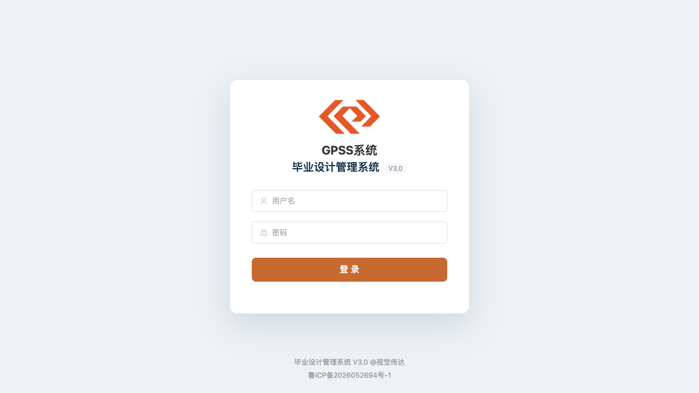
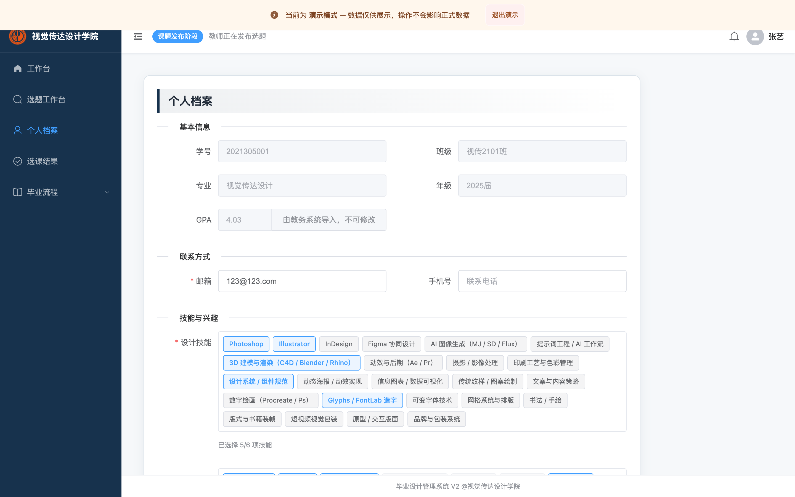
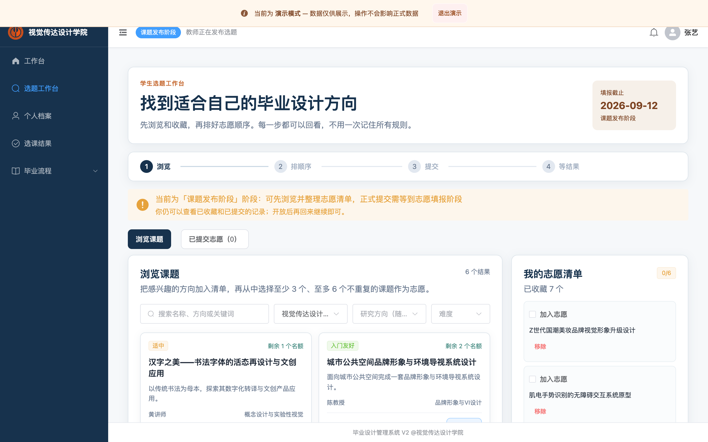
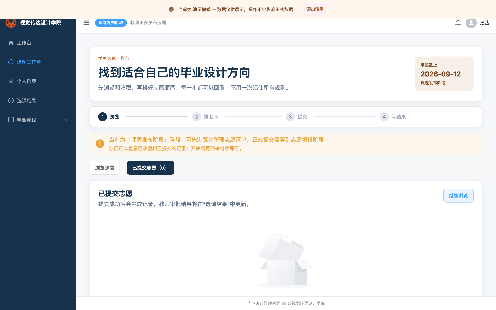
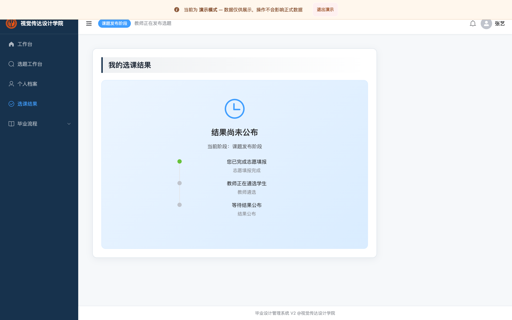
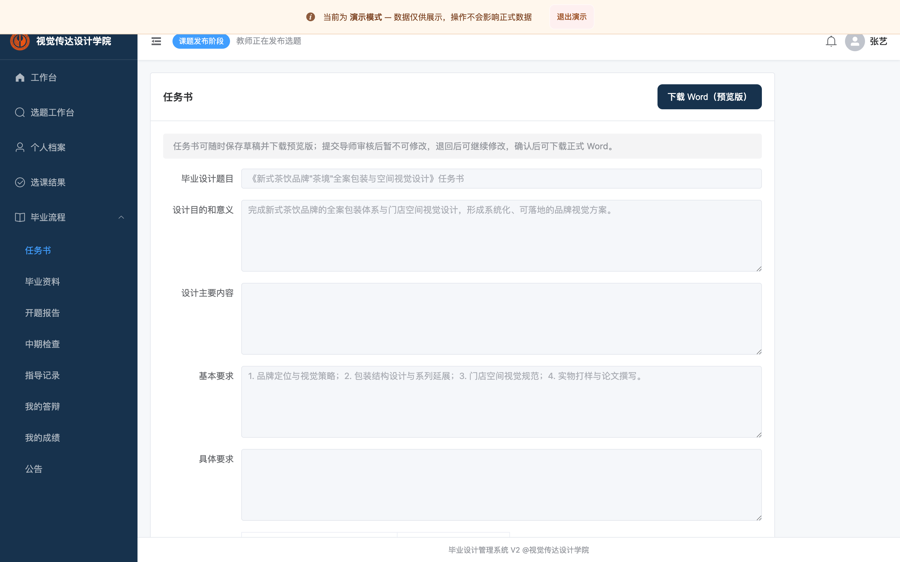
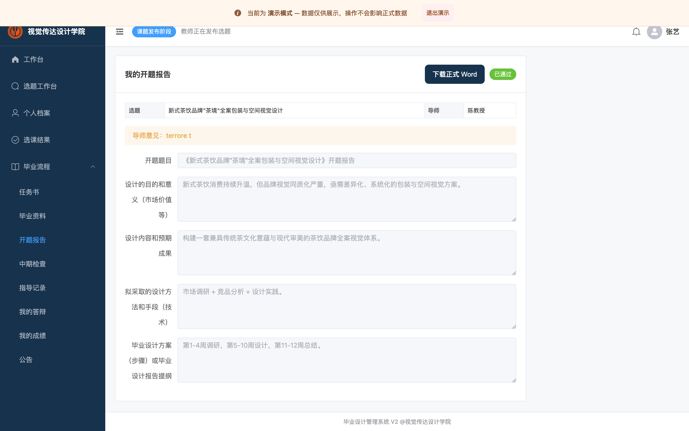
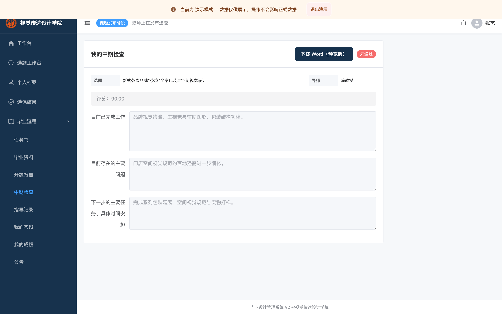

# 学生操作手册（部署版 V3.0）

> 部署地址： [http://www.bsxt.cc/gpss/](http://www.bsxt.cc/gpss/)
>
> 截图说明：登录页截图已从部署端 V3.0 实际页面更新；其余业务页面截图仍为 V2 示例画面，已逐处标注，待使用部署端账号补拍后替换。

> 适用：参与本科毕业设计的学生。请使用学院或管理员分配的账号登录；各“阶段”由学院管理员在选题周期中推进，未到对应阶段前，相关提交入口会提示不可用。

---

## 一、登录系统

1. 打开浏览器，输入系统地址 `http://www.bsxt.cc/gpss/`，进入登录页：

   

2. 输入学院或管理员下发的学号/账号与密码，点击「登录」。
3. 登录成功后会进入“首页”。首页可查看当前阶段、我的志愿数、待办提醒等。

   > 部署端 V3.0 首页截图待补。仓库现存的旧首页图片显示 404 错误页，未放入本手册。

> 提示：若提示“长时间未操作已自动退出”，重新登录即可。

---

## 二、完善个人档案（可选，建议先做）

1. 首页点击「完善个人档案」，或在左侧菜单进入「个人档案」。
2. 依次填写/核对：学号、班级、专业、届别、学分绩点（GPA）、技能标签、兴趣方向、自我简介等。

   

   > V2 示例截图；部署端 V3.0 对应页面截图待更新。

3. 点击「保存」。完善的档案会用于教师遴选与结果名单展示。

---

## 三、浏览选题与填报志愿（选题工作台）

> 说明：本系统采用“清单 → 排序 → 整批提交”的方式。每名学生最终需提交 **3–6 个不重复** 的志愿；提交后即冻结，进入录取流程。

1. 首页点击「进入选题工作台」/「浏览课题」，进入选题工作台：

   

   > V2 示例截图；部署端 V3.0 对应页面截图待更新。

2. **筛选课题**：在搜索框按名称/方向搜索；可按“专业方向”下拉筛选你可见的专业（只列出系统允许你浏览的专业）；选择专业后“研究方向”随之联动。
3. **查看课题详情**：点击课题卡片的「查看详情」，弹出详情抽屉，可查看导师、专业方向、名额、简介、要求等。
4. **加入清单**：在卡片或详情里点「加入清单」。右侧“我的志愿清单”会累加；至少收藏后再从清单勾选为志愿。
5. **整理志愿顺序**：在清单中勾选“第X志愿”，拖动排序（第 1 行为第一志愿、最优先）。每个课题最多出现在一个志愿位置，总志愿数为 3–6 个。
6. **确认并提交志愿**：点击「确认并提交志愿」，核对顺序后确认。成功后跳转结果页并生成提交凭证。
   - 提交少于 3 个、多于 6 个、或重复课题会被系统拒绝；
   - 提交后进入“仅浏览”状态，不能再次改动；如需调整请到调剂阶段或联系管理员。

7. 查看“已提交志愿”记录：工作台上方「已提交志愿」标签页，或首页「我的志愿」：

   

   > V2 示例截图；部署端 V3.0 对应页面截图待更新。

---

## 四、查看选课结果

1. 首页点击「查看选课结果」（或左侧“我的选课结果”），查看是否被录取、录取课题、导师：

   

   > V2 示例截图；部署端 V3.0 对应页面截图待更新。

2. 若显示“未录取/调剂中”，可在调剂阶段前往「调剂补录」选择仍有名额的课题并提交调剂申请。

---

## 五、任务书（下达与确认）

> 需先被正式录取，且管理员将周期推进到“任务书”阶段。

1. 左侧菜单进入「任务书」，页面展示你的任务书填写表：

   

   > V2 示例截图；部署端 V3.0 对应页面截图待更新。

2. 依次填写：设计目的和意义、设计主要内容、基本要求、具体要求、阶段工作计划（每阶段选月份）等，标题默认取课题名。
3. 点击「保存草稿」可暂存；确认无误后点击「提交」（提交后进入“待教师确认”）。
4. 教师确认后状态变为“已确认”，可点击「下载正式 Word」导出任务书文件；若教师退回修改，按退回意见修改后重新提交。

---

## 六、开题报告

> 前置条件：任务书已被导师确认。

1. 左侧进入「开题报告」，填写：设计的目的和意义、设计内容和预期成果、设计方法和手段、设计步骤/报告提纲：

   

   > V2 示例截图；部署端 V3.0 对应页面截图待更新。

2. 保存草稿或点击「提交」。提交后由指导教师审核（通过/退回修改/拒绝）。
3. 在页面查看审核结果与导师意见：
   - **通过**：可继续下一环节；
   - **退回修改**：按意见修改后重新提交；
   - **拒绝**：学生端不能自行再次提交，请联系导师或管理员处理。

---

## 七、中期检查

> 前置条件：开题报告已审核通过。

1. 左侧进入「中期检查」，填写：目前已完成工作、存在的主要问题、下一步任务与时间安排：

   

   > V2 示例截图；部署端 V3.0 对应页面截图待更新。

2. 保存草稿或点击「提交」，等待导师评分并评价（通过/不通过/退回修改）。
3. 中期“不通过”仅代表本环节结果，**不会影响你开题报告已有的通过状态**；学生端不能自行再次提交，请联系导师或管理员处理。

---

## 八、常见问题与注意事项

- **阶段未开放**：某一环节提交时提示“当前不在 XX 阶段”，说明该阶段尚未由管理员开启，请等待学院推进。
- **前置未满足**：提交开题/中期提示需先完成前一环节（任务书确认/开题通过），请先完成前置步骤。
- **一旦通过不可逆**：任务书确认、开题通过、中期通过后不能自行退回，如有错误请联系教师/管理员处理。
- **结果/通知**：教师审核结果会以“站内通知”推送给学生，正文使用中文表达（通过/退回修改/拒绝/不通过）。
- 如忘记密码，请联系管理员重置。
