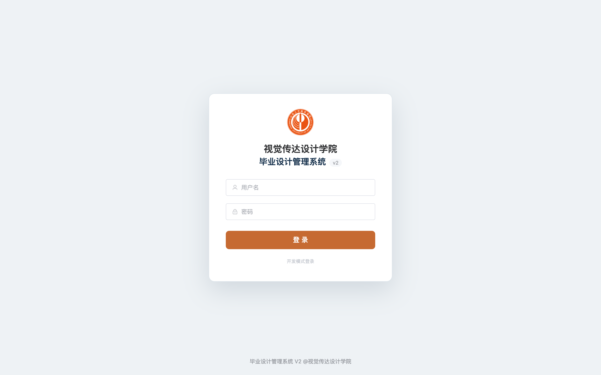
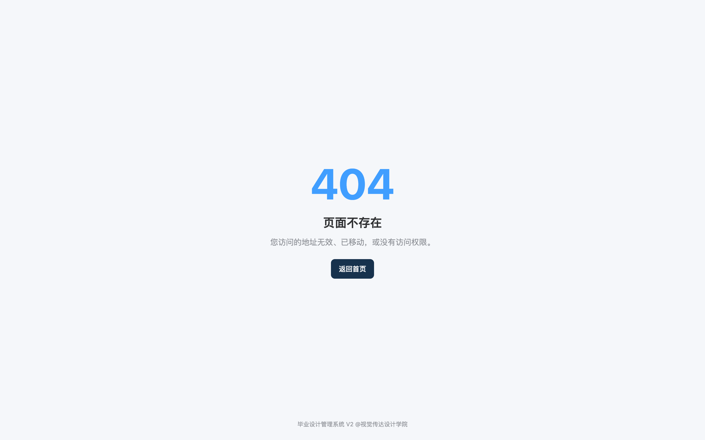
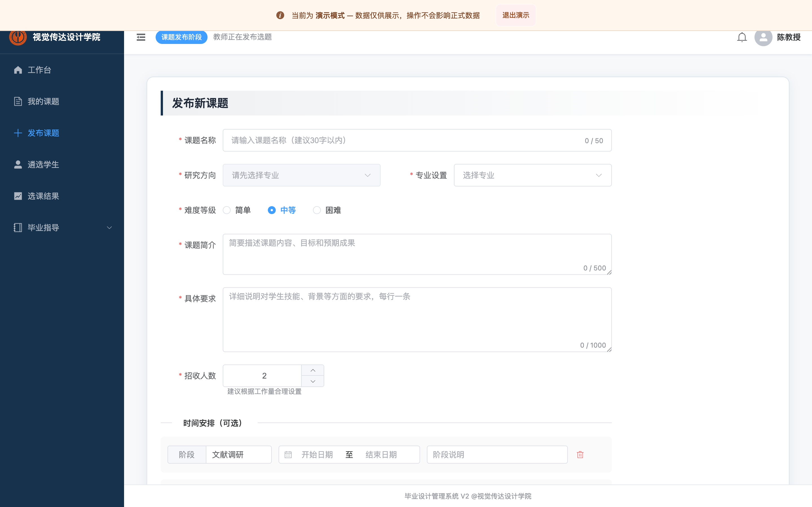
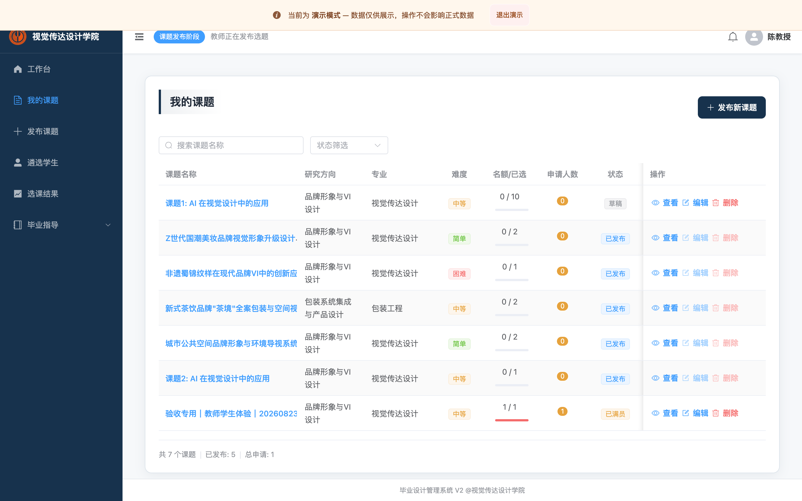
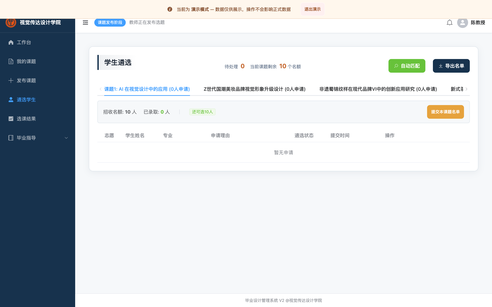
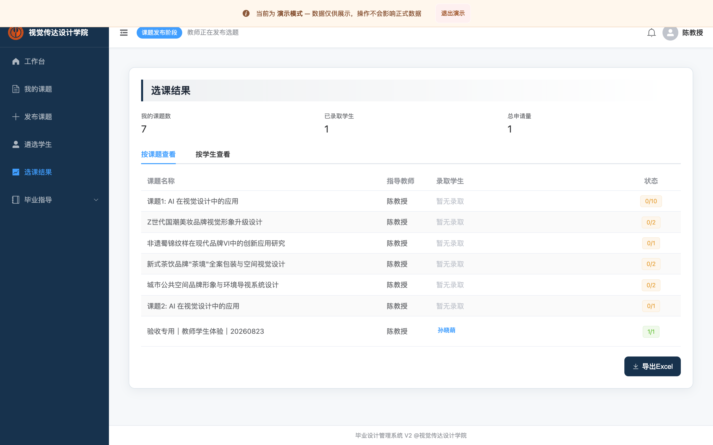
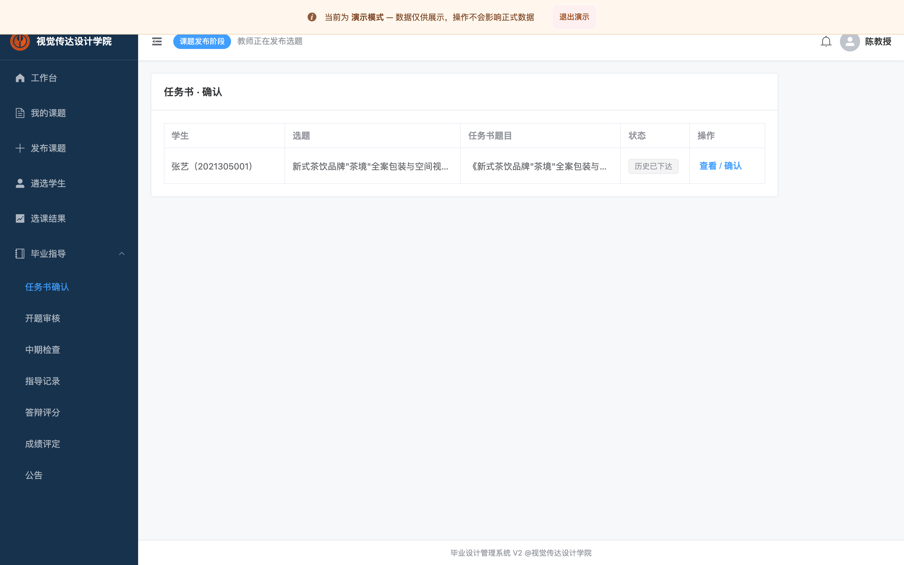
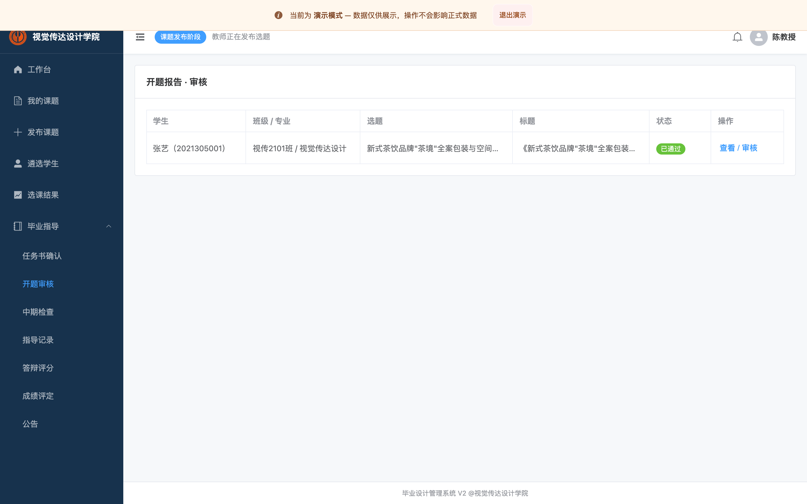
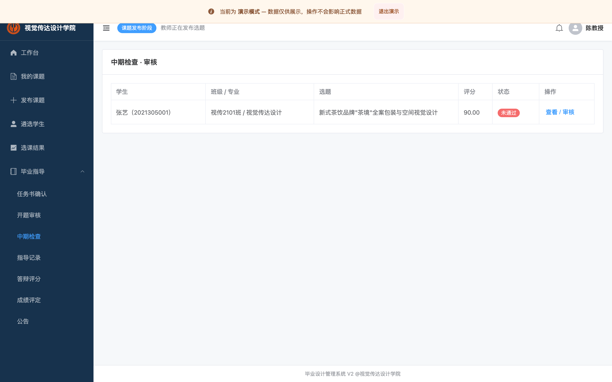

# 教师操作手册（毕业设计选题与毕业流程）

> 适用：指导本科毕业设计的教师。演示账号 `chen / 123456`。以下截图以教师“陈老师”界面为例；功能以“当前周期 + 当前阶段”为准。

---

## 一、登录系统

1. 浏览器打开系统地址（如 `http://<服务器>/gpss/`），进入登录页：

   

2. 输入教师账号与密码（演示密码 `123456`），点击「登录」。

3. 进入教师首页：可查看待办（待审核申请/任务书等）、我的课题数、当前阶段快捷入口：

   

---

## 二、发布课题

1. 首页点击「发布新课题」，或左侧「课题管理 → 发布新课题」，进入课题表单：

   

2. 按序填写：
   - **研究方向**：先选择专业（专业设置），研究方向下拉会随所选专业联动、仅显示该专业方向；
   - **专业设置**：选择本课题面向的毕业专业（代码）；
   - **课题名称**：建议 ≤30 字；
   - **难度等级、招收人数、课题简介、具体要求、阶段安排（可增删时间节点）、标签**；
   - 如有需要可上传附件。
3. 点击「提交至学院审核」→ 课题进入“待审核”，由管理员在选题库发布；
   - 也可点击「存为草稿」稍后继续（草稿仅自己可见）。
4. 待管理员发布后，课题状态变为“已发布”，学生才能浏览与填报。

> 注意：**已正式发布的课题会被锁定**，不能自行编辑/改状态/删除；如需修改，请联系管理员在“选题库管理”中“撤回发布”后，你才能再次编辑并重新提交。

---

## 三、管理我的课题

1. 左侧「课题管理 → 我的课题」查看全部课题及状态（草稿/待审核/已发布/已满员/已关闭）：

   

2. 行内操作：
   - **查看**：查看详情；
   - **编辑**：草稿/待审核/撤回后的课题可编辑；**已发布的课题“编辑”按钮置灰**；
   - **删除**：仅草稿等非发布状态可删除。
3. 顶部可按状态筛选、按名称搜索；“统计区”显示已发布数/总申请。

---

## 四、遴选学生（审批申请/录取名单）

> 需处于“遴选/审核”阶段。

1. 首页点击「遴选学生」或左侧「课题管理 → 学生遴选」，进入遴选页：

   

2. 左侧/顶部选择一个课题，查看该课题下的申请学生。
3. 对每条申请选择处理：
   - **录取**：通过（系统校验名额、每生仅一门、教师带生上限等）；
   - **拒绝**：不通过；
   - **候补/待定**：等前序志愿落选后顺延。
4. 处理完本课题后点击「提交/确认本课题名单」：未选中的学生会自动进入下一志愿/调剂，系统自动释放名额。

> 规则：若课题已被学生锁定录取，录取结果会反映在你的“选课结果”中；名单一经确认不可由普通操作回退，请谨慎操作。

---

## 五、查看选课结果并导出

1. 左侧「课题管理 → 选课结果」，按课题或按学生查看录取结果统计：

   

2. 点击右上「导出Excel」，系统会按当前教师已录取结果生成 `.xlsx` 文件下载（文件名：教师名_选课结果_日期）。

---

## 六、任务书确认

1. 左侧「任务书」进入待确认列表（也可从首页待办进入）：

   

2. 查看学生提交内容，核对无误后点击「确认」；如需修改点击「退回修改」并填写意见。
3. 学生按意见修改后重新提交，再行确认。
   - 任务书**一旦确认不可逆**：确认后不可再退回；学生内容也锁定（如确有错误，请管理员处理）。

---

## 七、开题报告审核

1. 左侧「开题报告 / 开题审核」，选择待审学生记录：

   

2. 查看开题内容，进行审核：
   - **通过**：通过后不可逆，学生可进入中期；
   - **退回修改**：填意见后学生修改重提；
   - **拒绝**：拒绝后学生可沟通重新提交（在通过前）。
3. 前置提醒：只能审核“其任务书已确认”学生的开题。

---

## 八、中期检查评分与审核

1. 左侧「中期检查 / 中期审核」，查看学生已提交的中期记录：

   

2. 填写**评分**并审核：
   - **通过**：通过后不可逆；
   - **不通过**：要求整改，学生可修改后重提；**不影响该生开题报告已有的通过状态**；
   - **退回修改**：附意见退回。
3. 审核结果将以站内通知（中文）推送给学生。

---

## 九、常见问题

- **看不到某阶段入口/不能操作**：请确认管理员已将周期推进到对应阶段。
- **课题想改却改不了**：已发布课题已锁定，请管理员“撤回发布”后再编辑。
- **导出 Word/Excel 异常**：确认对应正式模板已由管理员在“毕业资料库”发布；导出内容以模板排版为准。
- 学生或密码相关问题请联系管理员。
