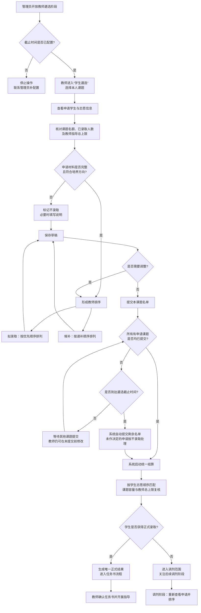

# 教师遴选学生流程及注意事项

- 适用系统：GPSS 毕业设计管理系统
- 适用角色：指导教师
- 适用阶段：教师遴选阶段、调剂阶段

## 一、先看结论

教师遴选的核心不是“先点录取再调整”，而是：

1. 先核对课题信息、名额和指导上限；
2. 再结合学生材料形成“拟录取—候补—不录取”的明确排序；
3. 保存草稿，确认无误后提交本课题名单；
4. 等待系统按学生志愿顺序、课题容量和教师指导上限统一结算；
5. 结算完成后，再根据正式结果进入任务书和后续指导流程。

教师保存草稿不会直接改变学生正式结果；提交名单后，课题名单通常会锁定，结算前如需修改应联系管理员处理。

## 二、完整流程图

## 三、操作步骤

### 1. 遴选前：先确认条件

进入“课题管理 → 学生遴选”前，教师应确认：

- 当前周期已经进入教师遴选阶段；
- 管理员已配置有效的教师遴选截止时间；
- 课题标题、研究方向、专业设置、要求和阶段安排准确；
- 课题招收人数与本人所有课题的指导总上限没有冲突；
- 已发布课题的名额、已录取人数和当前申请人数清楚可见。

如果看不到入口、申请名单为空或按钮不可用，先检查周期阶段、课题状态和管理员配置，不要反复刷新或重复提交。

### 2. 查看申请：以申请材料为依据

逐个课题查看申请学生，重点核对：

- 专业和研究方向是否匹配；
- 志愿序号，尤其是第 4—6 志愿是否显示正确；
- 个人陈述、兴趣方向、技能标签和相关经历；
- 学生对课题要求的理解程度与可执行性；
- 学生现有基础与课题难度是否匹配；
- 学生数量是否已经接近课题名额或教师指导上限。

建议先建立“必须满足的条件”和“可比较的条件”：前者用于排除明显不匹配，后者用于形成拟录取和候补顺序。不要仅凭申请时间或单一标签作决定。

### 3. 形成名单：三类决定要清楚

系统支持的教师决定包括：

| 决定 | 使用方式 | 注意事项 |
|---|---|---|
| 拟录取 | 放入正式优先序列，并按顺序排列 | 排名从 1 开始连续，不能超过课题剩余名额 |
| 候补 | 放入递补序列，并按顺序排列 | 候补不是正式录取，必须有明确递补顺序 |
| 不录取 | 明确不进入本课题录取序列 | 对明显不匹配申请应尽早处理，避免截止时被系统按未处理收口 |

建议采用“先拟录取、再候补、后不录取”的顺序整理。若暂时无法判断，可先不保存决定，但必须在截止前完成；截止时仍未处理的申请不会被系统推测为拟录取。

### 4. 保存草稿：先保存，后提交

“保存草稿”只是保存教师当前判断，不会立即改变学生正式结果。建议：

1. 先保存一版完整草稿；
2. 复核拟录取和候补的排序是否连续；
3. 再检查名额、教师总上限和跨课题重复录取风险；
4. 确认后点击“提交本课题名单”。

提交前应特别检查课题名称，避免把另一课题的名单提交到当前课题。提交后若页面显示“已提交，等待统一结算”，说明本课题已进入锁定状态。

### 5. 统一结算：系统按规则计算正式结果

统一结算时，系统综合处理：

- 教师的拟录取、候补和排序；
- 学生的志愿顺序；
- 课题招收人数；
- 教师跨课题的指导总上限；
- 同一学生只能正式录取一个课题。

因此，教师标记“拟录取”不等于学生最终一定进入本课题。若学生同时得到多个课题的拟录取意向，系统会优先保留该生志愿序号更高（数字更小）的课题，并释放其他课题名额，再由候补顺序递补。

### 6. 结算后：按正式结果衔接后续工作

- 正式录取学生：到“选课结果”确认名单，并进入任务书确认、开题、中期等后续流程；
- 未录取学生：关注调剂阶段，不要在首次遴选阶段私下承诺名额；
- 课题已满：等待系统更新课题状态，不要通过线下方式突破名额；
- 结算失败或出现配置冲突：联系管理员检查，不要重复点击造成误解。

## 四、教师判断学生时的建议维度

建议按“匹配度—可完成性—指导适配度—发展潜力”综合判断：

| 判断维度 | 可观察证据 | 不建议的做法 |
|---|---|---|
| 课题匹配度 | 专业方向、兴趣、技能标签、个人陈述 | 只看学生姓名、班级或熟悉程度 |
| 任务可完成性 | 基础能力、时间投入、软件/媒介条件、阶段目标 | 只因作品风格不合个人偏好就直接否定 |
| 指导适配度 | 沟通方式、反馈接受度、研究与实践倾向 | 以未经核实的传闻替代材料判断 |
| 发展潜力 | 学习意愿、问题意识、执行记录、迭代能力 | 把一次作品质量等同于最终毕业成果 |
| 公平与可解释性 | 统一标准、同类申请可比较、决定有依据 | 对不同学生使用不同尺度 |

对于需要排序的学生，建议给每位候选人留下简短的内部判断依据，例如“方向高度匹配、已有相关实践、阶段目标可执行”。如系统提供备注字段，可将必要说明写入系统，便于后续复核。

## 五、必须注意的风险

### 1. 名额和指导上限是两套约束

课题名额不等于教师还可以继续招收的人数。教师多个课题的拟录取人数合计不得超过指导总上限；即使单个课题没有超额，跨课题合计超限也可能导致提交或结算被阻止。

### 2. 志愿顺序会改变最终结果

教师的“拟录取”是意向，学生的志愿顺序参与最终匹配。不要在未结算前向学生承诺“已经确定录取”，正式结果以系统结算为准。

### 3. 候补必须排序

候补不是一个无序池。候补 1、候补 2、候补 3 应体现明确递补次序，且排序从 1 开始连续。候补越靠前，越可能在释放名额后获得录取。

### 4. 截止时间前必须完成提交

到达截止时间后，系统会自动提交未提交课题：已保存草稿按当前内容处理，仍未作决定的申请按不录取处理。不要把“保存草稿”误认为“提交名单”。

### 5. 提交后不要继续按普通教师权限修改

已提交名单通常处于锁定状态。确需修改时，应尽快联系管理员在结算开始前退回；统一结算开始或完成后，不能通过普通页面回退。

### 6. 不用 GPA 或申请时间替代教师判断

系统统一结算不使用 GPA 自动排序，也不以申请时间替代教师排序。GPA、申请时间等信息如被系统展示，只能作为辅助背景，不能替代专业匹配、课题要求和学生发展判断。

### 7. 学生信息应限于工作需要

教师只能基于本课题申请所需信息进行判断，不得转发学生个人材料、联系方式或与遴选无关的隐私信息。涉及争议时，保留事实依据并交由管理员按流程处理。

## 六、常见问题速查

| 情况 | 处理建议 |
|---|---|
| 看不到“学生遴选”入口 | 检查当前周期是否已进入教师遴选阶段 |
| 看不到学生申请 | 检查课题是否属于本人、是否已发布、当前周期是否正确 |
| 无法保存草稿 | 检查课题名额、指导上限、重复申请、版本提示并刷新页面 |
| 无法提交名单 | 检查拟录取/候补排序是否从 1 连续、是否超出名额或教师上限 |
| 提交后想改 | 结算前联系管理员退回；结算开始后不能按普通流程修改 |
| 学生称“老师已录取我” | 说明教师选择只是结算输入，正式结果以系统统一结算为准 |
| 学生未被录取 | 引导其关注调剂安排，不通过线下加名规避系统规则 |
| 结算结果与预期不同 | 先核对学生志愿顺序、课题容量、教师总上限和候补排序，再联系管理员复核 |

## 七、提交前一分钟自检

- [ ] 当前周期和课题名称正确；
- [ ] 课题名额、已录取人数、教师指导总上限已核对；
- [ ] 每位申请学生都有明确处理意见，或已确认未处理后果；
- [ ] 拟录取排序从 1 开始连续；
- [ ] 候补排序从 1 开始连续；
- [ ] 拟录取人数未超过课题剩余名额；
- [ ] 多个课题合计未超过教师指导上限；
- [ ] 已区分“保存草稿”和“提交本课题名单”；
- [ ] 未向学生承诺未经统一结算的最终结果；
- [ ] 提交后已保存必要的沟通记录或依据。

## 八、与后续流程的衔接

教师遴选完成后，正式录取学生进入后续毕业设计流程：任务书提交与确认、开题报告审核、中期检查、答辩和成绩等。教师应以系统正式录取结果为准开展指导，不要在任务书或开题环节为未正式录取学生建立线下替代流程。

---

**文档依据**：GPSS 当前教师操作手册、教师遴选页面、统一录取与调剂结算规则及项目验收测试。系统界面和阶段名称如有更新，以管理员发布的当前周期配置为准。
