# 毕业设计管理系统 · 使用说明

> 适用对象：学生、指导教师、系统管理员
> 系统版本：V2（选题 → 任务书 → 开题 → 中期 → 论文/作品 → 答辩 → 成绩 → 归档）

---

## 目录

- [一、系统登录](#一系统登录)
- [二、学生使用指南](#二学生使用指南)
  - [1. 选题工作台](#1-选题工作台)
  - [2. 查看任务书](#2-查看任务书)
  - [3. 提交开题报告](#3-提交开题报告)
  - [4. 提交中期检查](#4-提交中期检查)
  - [5. 提交毕业论文](#5-提交毕业论文)
  - [6. 提交设计作品](#6-提交设计作品)
  - [7. 填写指导记录](#7-填写指导记录)
  - [8. 查看成绩与答辩](#8-查看成绩与答辩)
- [三、教师使用指南](#三教师使用指南)
  - [1. 管理课题](#1-管理课题)
  - [2. 下达任务书](#2-下达任务书)
  - [3. 审核开题报告](#3-审核开题报告)
  - [4. 中期检查评分](#4-中期检查评分)
  - [5. 论文与作品批阅](#5-论文与作品批阅)
  - [6. 记录指导过程](#6-记录指导过程)
- [四、管理员使用指南](#四管理员使用指南)
  - [1. 全流程看板](#1-全流程看板)
  - [2. 答辩分组管理](#2-答辩分组管理)
  - [3. 成绩评定与发布](#3-成绩评定与发布)
  - [4. 公告管理](#4-公告管理)
  - [5. 选题周期与阶段切换](#5-选题周期与阶段切换)
  - [6. 用户管理](#6-用户管理)
- [五、常见问题](#五常见问题)

---

## 一、系统登录

打开系统后进入登录页，输入用户名和密码即可登录。系统提供「开发模式登录」入口，可一键使用演示账号快速体验各角色功能。

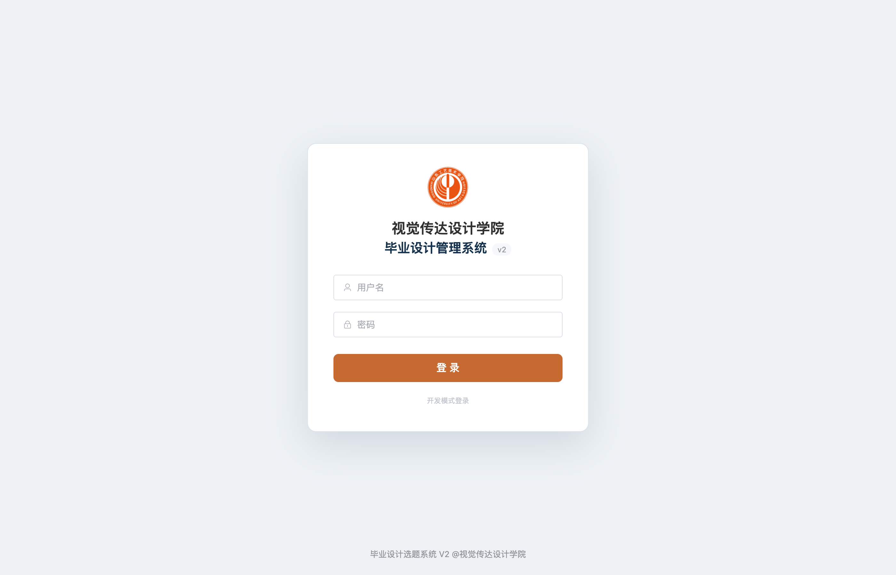

演示账号如下：

| 角色 | 用户名 | 密码 | 说明 |
|------|--------|------|------|
| 管理员 | `admin` | `123456` | 全流程管理与系统配置 |
| 教师 | `chen` | `123456` | 课题发布、指导与批阅 |
| 学生 | `zhangyi` | `123456` | 选题与毕业全流程 |

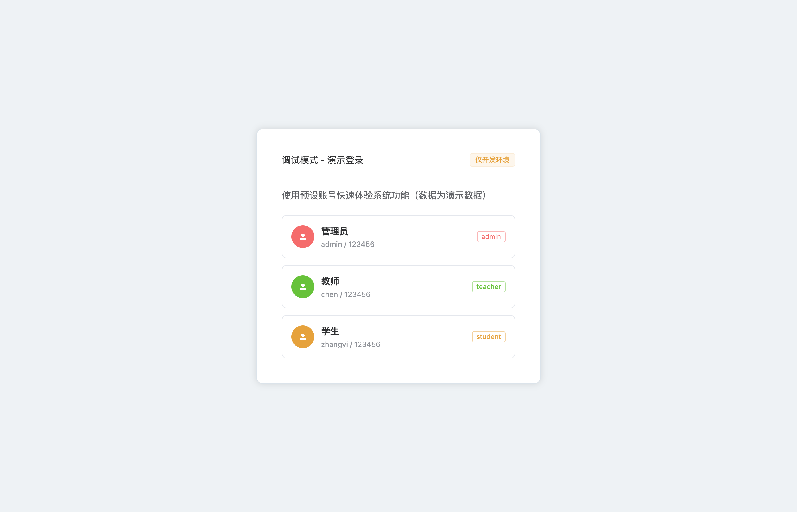

> 说明：开发模式仅用于演示环境，正式环境请在登录页使用账号密码登录。

---

## 二、学生使用指南

学生登录后，左侧菜单的「毕业流程」栏目覆盖了从选题到成绩的完整环节。下面按操作顺序说明。

### 1. 选题工作台

**入口：** 左侧菜单「选题工作台」

这是学生选课的起始页面，可浏览教师发布的课题、按关键词/专业方向/难度筛选，点击课题查看详情，并提交志愿申请。

**操作步骤：**
1. 在课题列表中浏览并筛选感兴趣的课题；
2. 点击课题卡片进入详情页，查看课题简介、要求与教师信息；
3. 在详情页点击「申请该课题」，填写优先级与申请理由后提交；
4. 可在「选课结果」中查看录取情况。

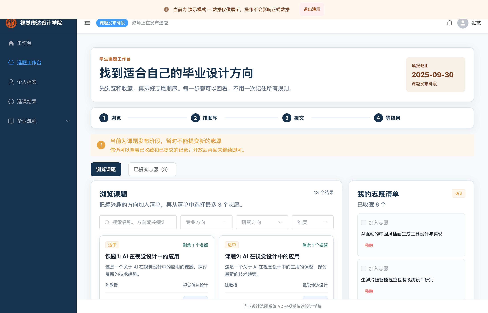

### 2. 查看任务书

**入口：** 左侧菜单「毕业流程 → 任务书」

选题录取后，导师会下达任务书。学生在此查看任务书标题、任务内容、成果要求、进度安排及附件。

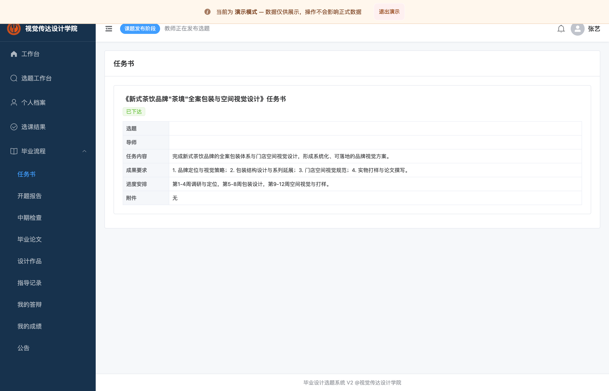

### 3. 提交开题报告

**入口：** 左侧菜单「毕业流程 → 开题报告」

进入开题阶段后，学生填写开题报告并提交给导师审核。

**操作步骤：**
1. 填写开题题目、选题背景、研究/设计目标、主要内容、方法与技术路线、进度计划；
2. 上传开题报告相关附件（PDF / Word / 压缩包）；
3. 点击「保存草稿」可暂存，点击「提交」正式提交导师审核；
4. 导师审核通过后，页面状态显示「已通过」并锁定，导师意见会以黄色提示条展示。

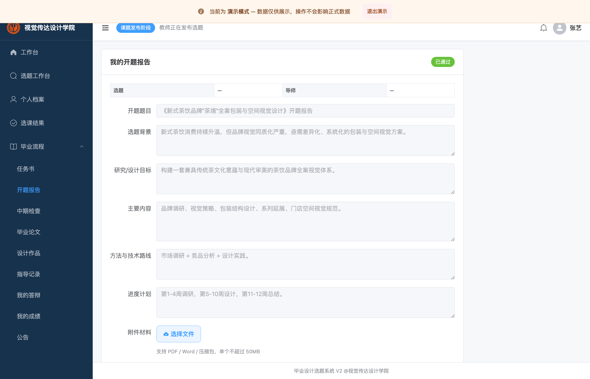

### 4. 提交中期检查

**入口：** 左侧菜单「毕业流程 → 中期检查」

中期阶段，学生填写进度总结、已完成内容、存在问题与后续计划，导师审核后给出评分与意见。

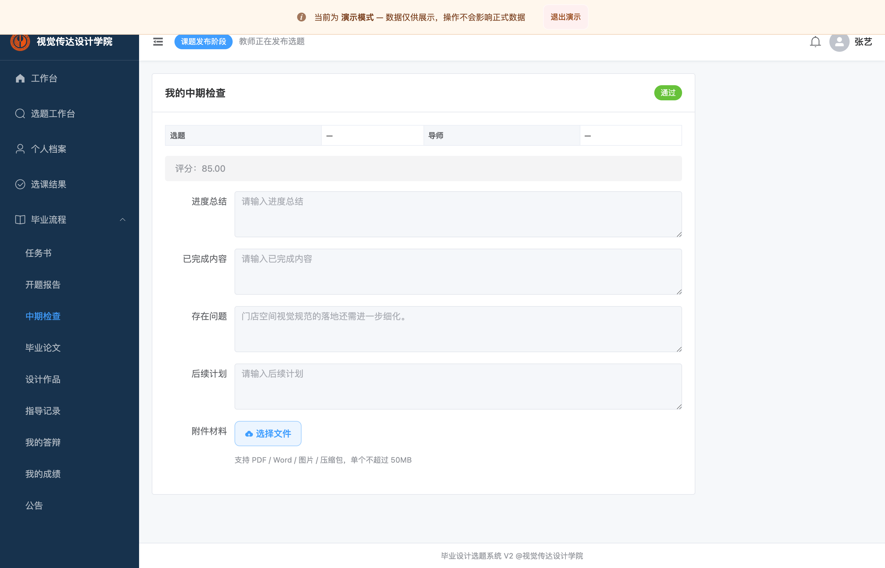

### 5. 提交毕业论文

**入口：** 左侧菜单「毕业流程 → 毕业论文」

学生填写论文标题、摘要、关键词，并上传论文文件（支持多版本重传）。提交后等待导师批阅。

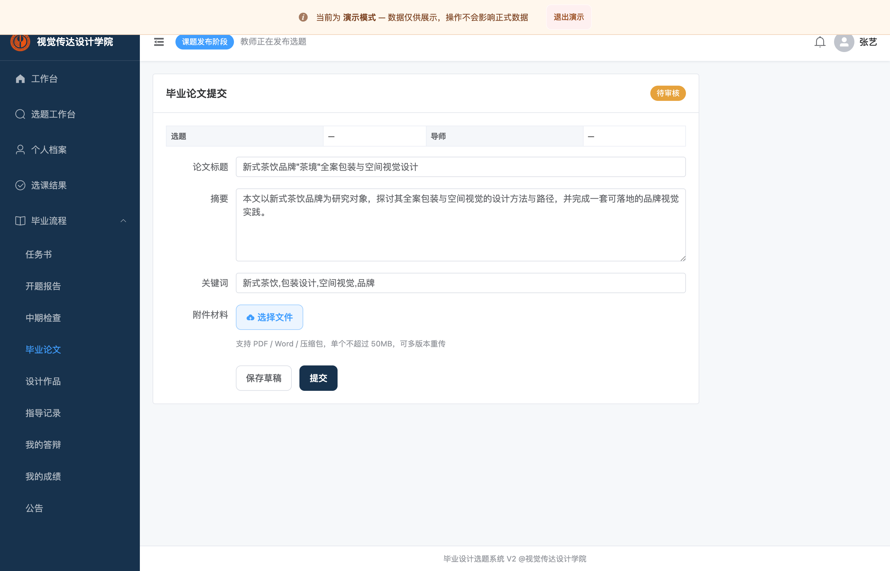

### 6. 提交设计作品

**入口：** 左侧菜单「毕业流程 → 设计作品」

学生填写作品名称、设计说明，并上传作品文件（支持图片 / 视频 / 模型 / 压缩包等多种格式）。

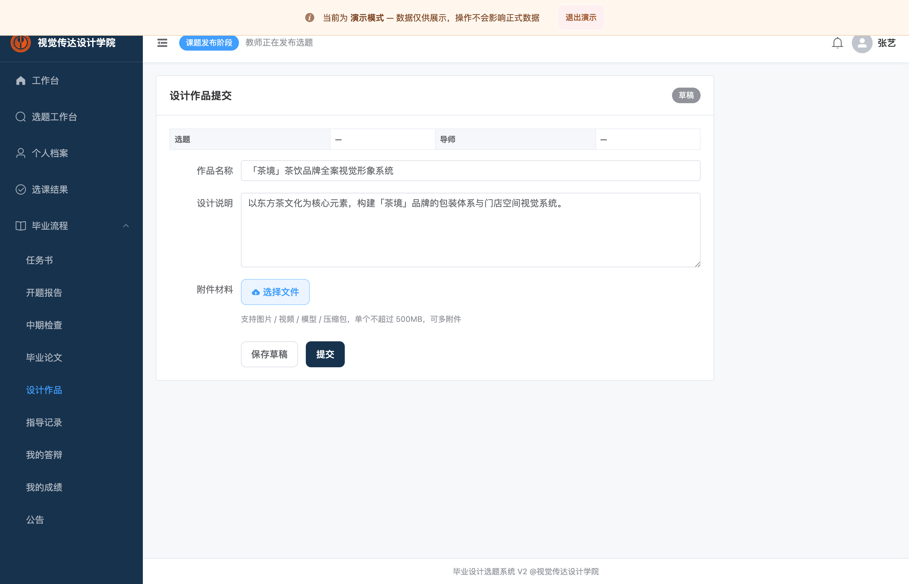

### 7. 填写指导记录

**入口：** 左侧菜单「毕业流程 → 指导记录」

学生可记录每次与导师交流的指导内容，形成完整的指导过程档案。

**操作步骤：**
1. 点击「新增指导记录」；
2. 填写指导日期、指导内容、下一步计划，可上传附件；
3. 保存后可在列表中查看历史记录。

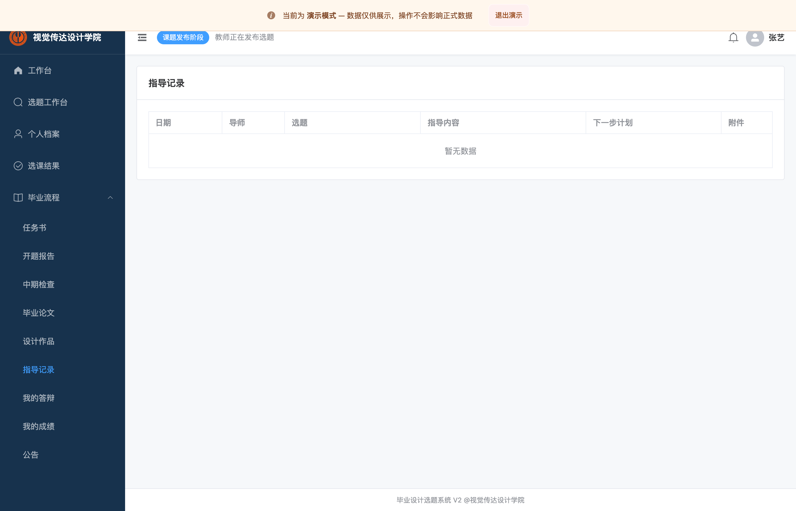

### 8. 查看成绩与答辩

**入口：** 左侧菜单「毕业流程 → 我的成绩 / 我的答辩」

- **我的成绩**：查看导师评分、评阅评分、答辩评分、总评成绩与等级。
- **我的答辩**：查看答辩分组、时间、地点、评委及各评委给出的分数。

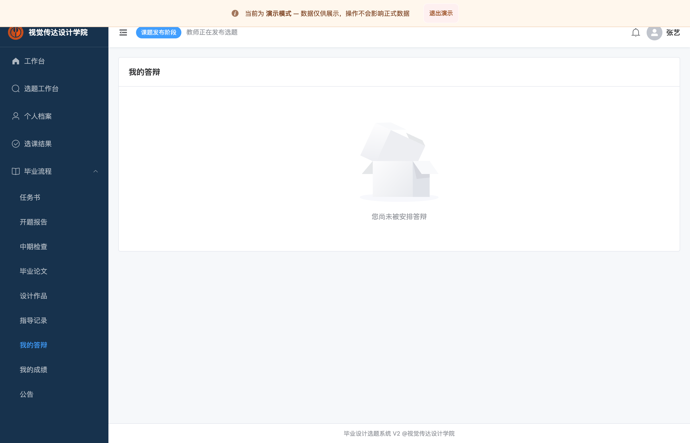

---

## 三、教师使用指南

教师登录后，左侧菜单「毕业指导」栏目覆盖了课题管理到成绩评定的完整环节。

### 1. 管理课题

**入口：** 左侧菜单「我的课题」「发布课题」

教师可查看自己发布的课题，新增/编辑/删除课题。课题发布后学生即可浏览并申请。

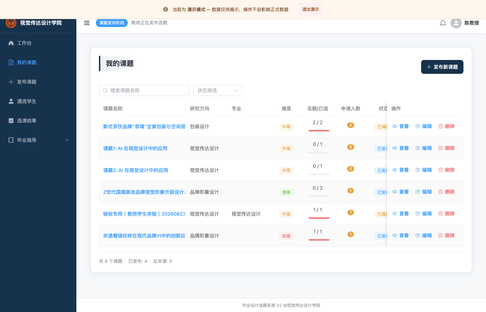

### 2. 下达任务书

**入口：** 左侧菜单「毕业指导 → 任务书下达」

在学生录取后，教师为其下达任务书。

**操作步骤：**
1. 点击「下达 / 编辑任务书」；
2. 从下拉框选择学生（仅显示已被录取到名下的学生）；
3. 填写任务书标题、任务内容、成果要求、进度安排，可上传附件；
4. 保存后学生端即可查看。

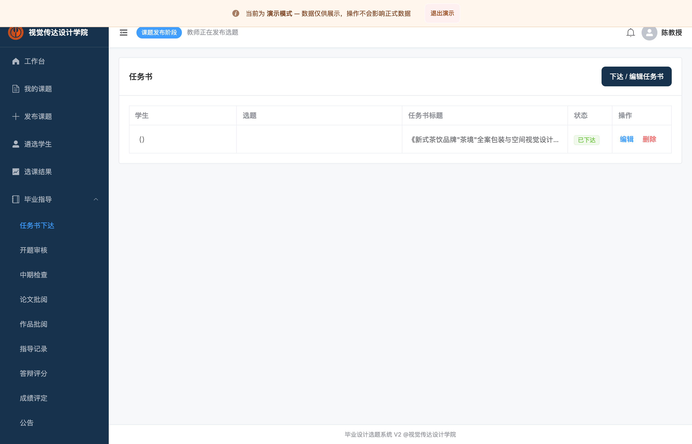

### 3. 审核开题报告

**入口：** 左侧菜单「毕业指导 → 开题审核」

教师查看学生提交的开题报告，逐条给出审核结论。

**操作步骤：**
1. 在列表中点击某学生的「查看 / 审核」；
2. 查看开题报告内容与附件；
3. 选择审核结论（通过 / 退回修改 / 不通过）并填写评语；
4. 点击「确认」提交，学生端会收到相应状态与意见。

### 4. 中期检查评分

**入口：** 左侧菜单「毕业指导 → 中期检查」

教师查看学生中期检查报告，除审核结论外还可给出评分（0-100 分）。

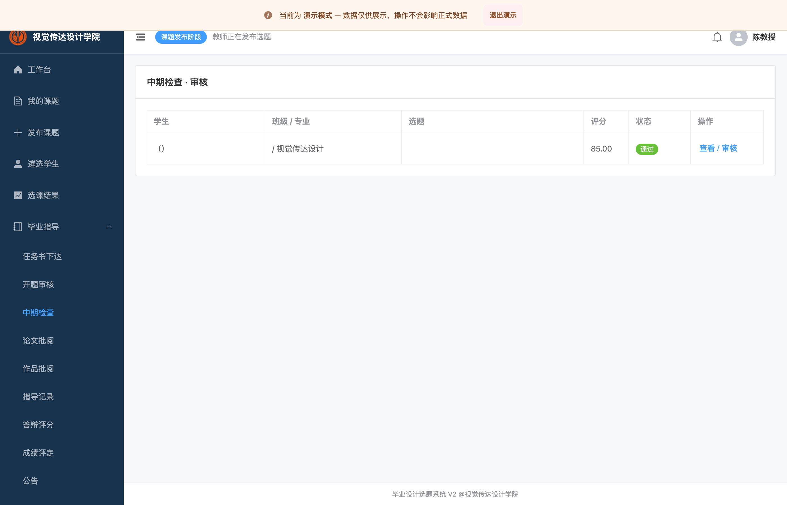

### 5. 论文与作品批阅

**入口：** 左侧菜单「毕业指导 → 论文批阅 / 作品批阅」

教师批阅学生的毕业论文与设计作品，结论支持通过 / 退回修改 / 不通过 / 定稿四种状态。

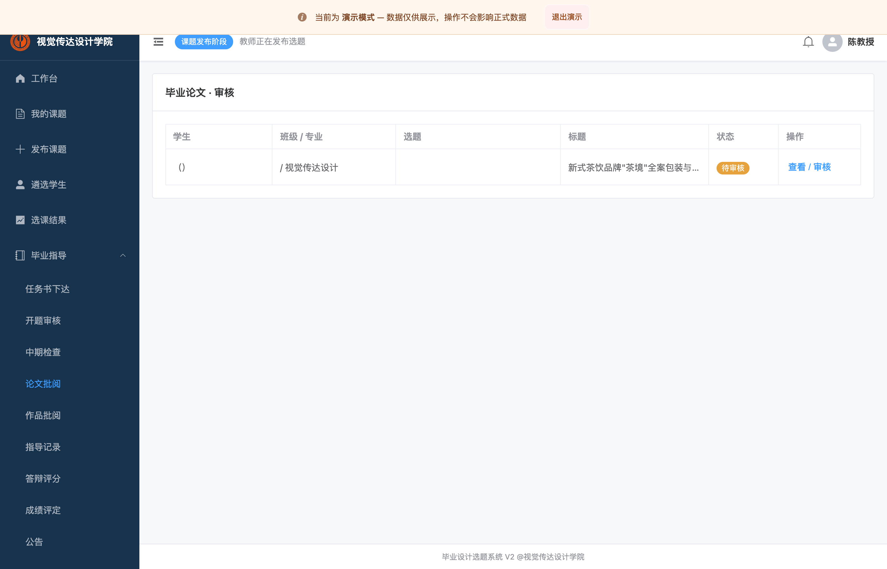

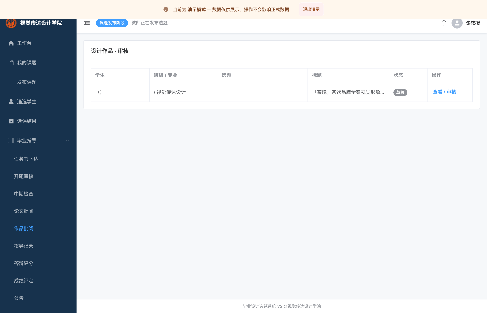

### 6. 记录指导过程

**入口：** 左侧菜单「毕业指导 → 指导记录」

教师为名下学生记录每次指导内容，便于过程管理与追溯。

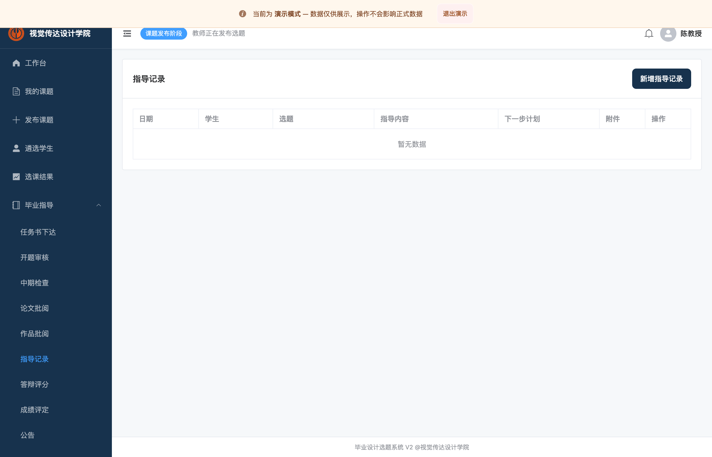

---

## 四、管理员使用指南

管理员登录后，左侧「系统管理」「数据总览」「毕业全流程」三个栏目提供全局管理能力。

### 1. 全流程看板

**入口：** 左侧菜单「毕业全流程 → 全流程看板」

看板展示当前所处阶段及各环节的数据统计（学生数、录取数、开题/中期/论文/作品提交数、答辩分组、成绩记录），便于整体把控进度。

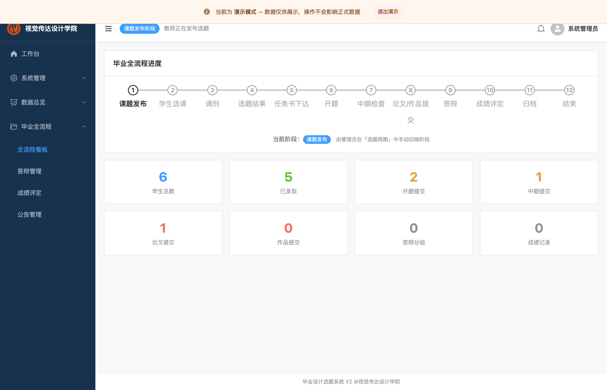

### 2. 答辩分组管理

**入口：** 左侧菜单「毕业全流程 → 答辩管理」

管理员创建答辩分组，指定评委与答辩学生，并在「评分总览」中查看各评委打分情况。

**操作步骤：**
1. 点击「新建分组」；
2. 填写分组名称、答辩时间、地点；
3. 选择评委（教师）与答辩学生；
4. 保存后，被指定的评委可在「答辩评分」中为学生打分。

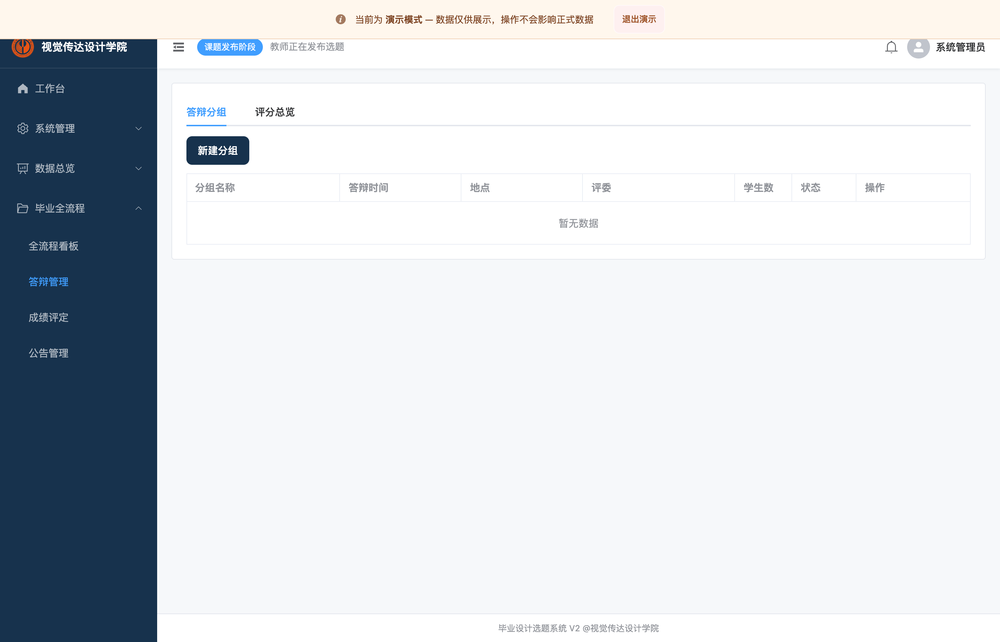

### 3. 成绩评定与发布

**入口：** 左侧菜单「毕业全流程 → 成绩评定」

管理员/导师录入学生成绩，管理员可发布最终成绩。

**操作步骤：**
1. 点击「录入 / 编辑成绩」选择学生；
2. 填写导师评分、评阅评分、答辩评分（系统按 40% / 20% / 40% 权重自动合成总分与等级）；
3. 保存后，点击「发布」将成绩正式发布给学生查看。

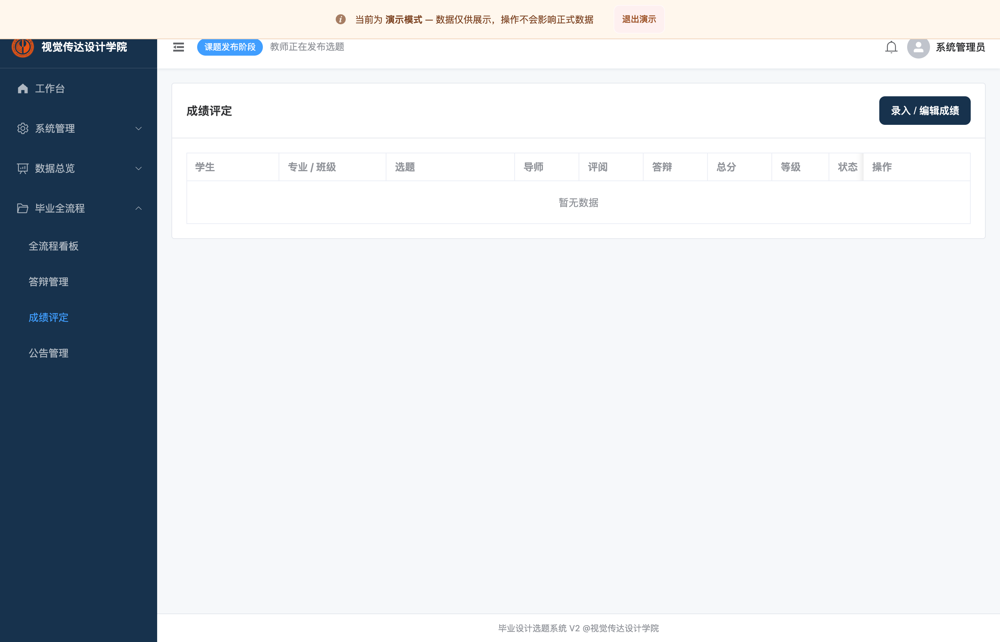

### 4. 公告管理

**入口：** 左侧菜单「毕业全流程 → 公告管理」

管理员/教师发布面向全体、学生或教师的公告，可设置发布或存草稿。

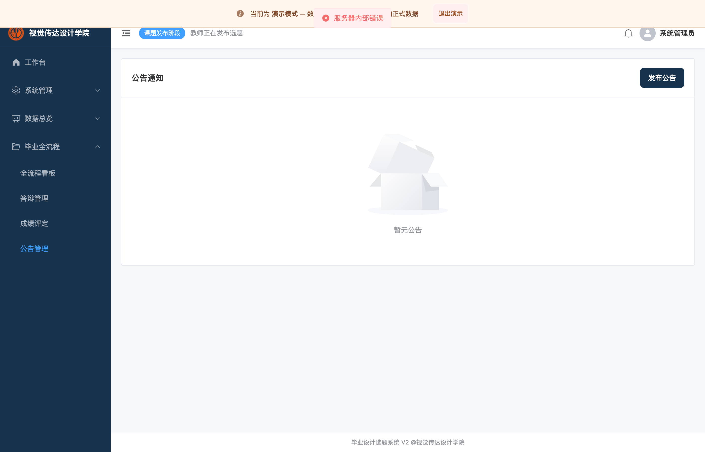

### 5. 选题周期与阶段切换

**入口：** 左侧菜单「系统管理 → 选题周期」

管理员创建选题周期，并通过**手动切换阶段**推进整个毕业流程。各环节（任务书、开题、中期、论文/作品、答辩、成绩）只有在对应阶段开启后，师生才能进行相应操作。

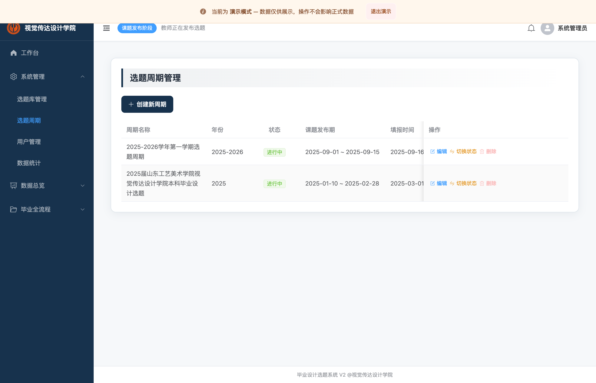

### 6. 用户管理

**入口：** 左侧菜单「系统管理 → 用户管理」

管理员对教师/学生账号进行增删改查、重置密码、批量导入等操作。

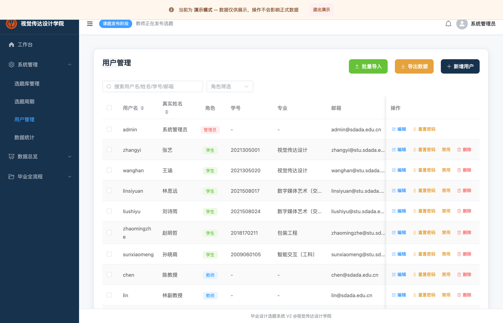

---

## 五、常见问题

**Q1：学生看不到「开题报告」等菜单？**
毕业全流程各环节由管理员在「选题周期」中手动切换阶段开启，只有当前阶段及之后的环节才会开放相应操作。请联系管理员确认当前所处阶段。

**Q2：提交后想修改怎么办？**
- 导师未审核时，学生可在页面上重新编辑并提交；
- 导师审核「退回修改」后，学生可修改后重新提交；
- 已「通过 / 定稿」的内容将锁定，如需修改请联系导师退回。

**Q3：上传文件有大小/格式限制吗？**
有。系统按文件类别限制了格式与大小（如论文/开题支持 PDF、Word，设计作品支持图片/视频/模型/压缩包）。上传前请留意页面上的提示文字。

**Q4：成绩总分如何计算？**
总分 = 导师评分 × 40% + 评阅评分 × 20% + 答辩评分 × 40%，系统自动合成并评定等级（优秀/良好/中等/及格/不及格）。

**Q5：忘记密码怎么办？**
请联系管理员，在「用户管理」中对账号重置密码。
